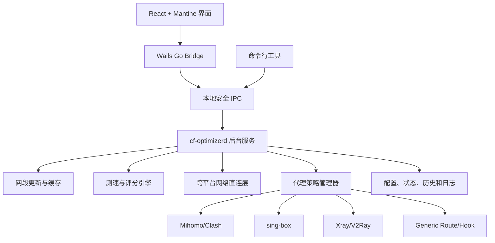

# CF Optimizer 跨平台实现计划

版本：1.0  
日期：2026-08-01  
目标平台：Windows、Linux、macOS（amd64、arm64）

## 1. 项目目标

开发一个独立的 Cloudflare 自动优选桌面工具，替代现有 CFST 脚本方案，并满足以下要求：

- 自动从 Cloudflare 官方数据源更新 IPv4、IPv6 网段。
- 自动生成候选 IP，并进行延迟、丢包、抖动和下载速度测试。
- 测速过程不使用系统代理，尽可能绕过 Clash、Mihomo、sing-box、Xray、WireGuard、OpenVPN 等代理或 VPN。
- 自动选择稳定的最优 IP，避免因为小幅波动频繁切换。
- 自动维护最优 IP 的系统直连路由及代理软件 DIRECT 策略。
- 以系统后台服务运行，支持开机启动、周期测速和网络变化触发复测。
- 使用 Wails + React + Mantine 提供跨平台桌面管理界面。
- 所有系统修改均可验证、回滚和审计。

## 2. 范围与边界

### 2.1 首个正式版本范围

- IPv4 与 IPv6 测速。
- Windows Service、systemd、LaunchDaemon。
- Mihomo/Clash、sing-box、Xray 和 Generic Route 适配器。
- Windows Hosts 可选更新。
- Cloudflare 官方网段自动更新和本地缓存。
- 桌面总览、测速、代理适配、路由、网段、历史、日志和设置页面。
- Windows、Linux、macOS 安装包。

### 2.2 暂不纳入首版

- 手机端。
- 云端账号和配置同步。
- 公共测速结果共享。
- 自建 VPN 驱动。
- 绕过具有强制 Kill Switch 或内核过滤策略的第三方 VPN。
- 自动修改无法识别或没有稳定配置接口的闭源代理软件。

对于不能可靠绕过的 VPN，程序只报告检测结果并引导用户配置进程或 IP 排除，不尝试破坏其安全策略。

## 3. 技术选型

| 领域 | 方案 |
|---|---|
| 核心语言 | Go |
| 桌面容器 | Wails |
| 前端 | React + TypeScript + Vite |
| UI组件 | Mantine |
| 服务端状态 | TanStack Query |
| 表格 | TanStack Table |
| 界面状态 | Zustand |
| 表单 | React Hook Form + Zod |
| 图表 | Apache ECharts |
| 图标 | Lucide |
| 本地数据 | SQLite 或纯文件状态存储；首版优先 SQLite |
| 配置格式 | YAML |
| 结构化日志 | Go slog + 文件轮换 |
| 本地通信 | Windows Named Pipe、Unix Domain Socket |
| 自动化测试 | Go test、Vitest、Playwright |

Wails 使用操作系统 WebView，不捆绑完整 Chromium。目标安装包约为 Windows 18–35 MB、macOS 20–40 MB、Linux DEB/RPM 15–30 MB。

## 4. 总体架构



### 4.1 进程划分

`cf-optimizerd`：以系统权限运行，负责测速、路由、Hosts、代理策略、定时任务和状态存储。

`cf-optimizer-ui`：普通用户权限运行，负责显示和操作，不直接修改系统配置。

`cf-optimizer`：命令行管理工具，用于安装服务、立即测速、查看状态、诊断和卸载。

关闭桌面界面不得停止后台服务或正在执行的测速任务。

## 5. 代码组织

```text
cf-optimizer/
├─ cmd/
│  ├─ daemon/
│  ├─ cli/
│  └─ desktop/
├─ internal/
│  ├─ ranges/
│  ├─ candidates/
│  ├─ benchmark/
│  ├─ optimizer/
│  ├─ network/
│  │  ├─ windows/
│  │  ├─ linux/
│  │  └─ darwin/
│  ├─ proxy/
│  │  ├─ mihomo/
│  │  ├─ singbox/
│  │  ├─ xray/
│  │  ├─ generic/
│  │  └─ external/
│  ├─ service/
│  ├─ ipc/
│  ├─ config/
│  ├─ store/
│  └─ diagnostics/
├─ desktop/frontend/
├─ packaging/
│  ├─ windows/
│  ├─ linux/
│  └─ macos/
└─ tests/
```

平台代码使用 Go build tags 隔离，测速、评分、配置和代理策略模型保持跨平台共享。

## 6. Cloudflare 网段管理

### 6.1 数据源

主数据源：

```text
https://api.cloudflare.com/client/v4/ips
```

备用数据源：

```text
https://www.cloudflare.com/ips-v4
https://www.cloudflare.com/ips-v6
```

程序内置一份经过验证的网段快照，确保首次启动和离线状态可用。

### 6.2 更新策略

- 默认每24小时检查一次，增加随机抖动。
- 使用 ETag 或数据哈希避免重复写入。
- 验证 CIDR 格式、地址类别、数量范围和新旧变化比例。
- 拒绝默认路由、私网、回环、链路本地、组播和格式异常网段。
- 写入 `ranges.json` 前先写临时文件，再原子替换。
- 保留 `ranges.previous.json` 作为回退版本。
- 支持用户 `include` 和 `exclude` 列表。

每个测速任务在开始时取得不可变网段快照。更新不会修改正在执行的测速任务。

### 6.3 当前节点失效处理

当当前最优 IP 不再属于新官方网段时：

1. 将节点标记为过期，但暂不删除其路由。
2. 立即触发一次重新优选。
3. 新节点验证成功后切换策略。
4. 删除旧节点路由和代理规则。

## 7. 候选 IP 与测速算法

### 7.1 候选生成

- IPv4 大网段逻辑划分为 `/24` 后抽样，不完整枚举。
- IPv6 根据网段和每日种子生成确定性随机地址。
- 默认候选总量控制在500–2000个。
- 优先加入上次成功节点和历史表现较好的网段。
- 对连续失败节点设置冷却期。
- 排除网络地址、广播地址和用户排除网段。

### 7.2 第一阶段：连接质量

- 使用原始 TCP Socket 连接443端口。
- 每个候选测试4–6次。
- 统计连接成功率、平均延迟、P95延迟和抖动。
- 不依赖 ICMP，避免运营商或防火墙屏蔽 Ping。
- 丢包、超时或延迟超过阈值的节点直接淘汰。

### 7.3 第二阶段：TLS与下载速度

- 对第一阶段前10–30名执行 TLS 握手。
- 连接目标 IP，但使用测试域名作为 SNI 和 HTTP Host。
- 使用用户可配置的 Cloudflare 测速地址。
- 单节点测速限制时间和最大下载量。
- 统计握手时间、首字节时间和稳定吞吐量。

生产环境建议使用项目自有 Cloudflare 测速域名，避免长期依赖第三方测速地址。

### 7.4 评分与切换

综合考虑：

- 下载速度。
- TCP/TLS延迟。
- 丢包率。
- 延迟抖动。
- 历史成功率。
- 最近失败次数。

加入切换迟滞：只有新节点综合表现比当前节点高出默认15%，或当前节点连续失败，才执行切换。

## 8. 测速不走代理

### 8.1 应用层

- 不使用系统 HTTP 代理。
- 不读取 `HTTP_PROXY`、`HTTPS_PROXY`、`ALL_PROXY`。
- 使用原始 TCP Dialer 和显式 TLS 配置。
- DNS需要时通过绑定物理接口的解析器获取真实地址，规避 Fake-IP。

### 8.2 系统网络层

测速开始前：

1. 识别真实物理网卡和默认网关。
2. 排除 TUN、TAP、Wintun、utun、Hyper-V、Docker、虚拟机和已知 VPN 接口。
3. 为本次候选网段建立指向物理网关的临时路由。
4. 将测速 Socket 显式绑定到物理网卡。

测速完成后删除临时网段路由，只保留最终最优 IP 的 `/32` 或 `/128` 主机路由。

平台实现：

| 平台 | 网卡绑定 | 路由管理 |
|---|---|---|
| Windows | `IP_UNICAST_IF` | IP Helper API |
| Linux | `SO_BINDTODEVICE` | netlink |
| macOS | `IP_BOUND_IF` | Routing Socket |

### 8.3 绕行验证

提供 `test-route` 诊断命令，输出：

- 使用的物理网卡和网关。
- 实际选择的源地址。
- 到目标 IP 的路由。
- 检测到的代理进程和虚拟接口。
- 代理 DIRECT 策略是否生效。
- 可能覆盖路由的 Kill Switch 或强制过滤提示。

## 9. 代理策略适配

### 9.1 统一策略模型

```go
type DirectPolicy struct {
    Processes []string
    IPv4CIDRs []string
    IPv6CIDRs []string
    Domains   []string
}
```

适配器至少实现：检测、能力声明、变更计划、应用、验证和回滚。

### 9.2 应用优先级

1. 官方控制 API 热更新。
2. Overlay、Mixin 或 Rule Provider。
3. 带程序标记的配置区块。
4. 操作系统路由。
5. 用户自定义外部脚本。

不得无标记地改写完整订阅配置。配置修改必须备份，并避免订阅刷新后无限追加重复规则。

### 9.3 首版适配器

- Mihomo/Clash：控制 API、规则注入和热加载。
- sing-box：路由规则、配置验证和安全重载。
- Xray/V2Ray：routing规则和受控重启。
- Generic Route：只依赖系统主机路由。
- External Hook：执行受限的用户自定义应用/撤销程序。

后续版本增加 Surge、WireGuard、OpenVPN 和更多商业 VPN 的检测能力。

第三方扩展采用独立进程和版本化 JSON-RPC 协议，不使用 Go原生插件。

## 10. 后台服务与调度

统一CLI：

```text
cf-optimizer install
cf-optimizer uninstall
cf-optimizer start
cf-optimizer stop
cf-optimizer run
cf-optimizer status
cf-optimizer test-route
```

平台服务：

- Windows：Windows Service，默认使用 LocalSystem。
- Linux：systemd unit，使用 root 或收敛后的 capabilities。
- macOS：LaunchDaemon，使用 root。

默认调度：

- 开机后网络可用时执行一次。
- 每6小时重新优选。
- 网络接口或默认网关变化后进行快速复测。
- 同一时间只允许一个测速任务。
- 异常退出由系统服务管理器重启。
- 失败采用指数退避，避免持续占用网络。

## 11. 本地IPC与安全

- Windows使用 Named Pipe 并设置ACL。
- Linux/macOS使用 Unix Domain Socket 并设置文件权限。
- 不开放特权 localhost HTTP 端口。
- 服务端验证所有参数，前端校验不能代替服务端校验。
- 使用版本化消息协议，支持界面与服务版本不一致提示。
- 长任务通过事件流发送进度，普通状态通过请求响应读取。
- 对路由、Hosts和代理配置修改记录操作日志和回滚数据。

## 12. 桌面界面计划

### 12.1 页面

- 总览：服务状态、当前IP、出口网卡、代理状态、下次测速。
- 测速优选：实时进度、候选IP表格、延迟和速度图表。
- 代理适配：已检测内核、能力、应用方式和验证结果。
- 网络路由：物理网卡、网关、临时路由和永久路由。
- 网段管理：来源、版本、更新时间、差异和自定义范围。
- 历史记录：历次最优IP、评分和切换原因。
- 日志诊断：可筛选日志、诊断结果和导出报告。
- 设置：周期、并发、阈值、测速地址、IPv4/IPv6开关。

### 12.2 状态管理

- TanStack Query维护后台服务状态和配置。
- Wails Events传输实时测速进度。
- Zustand只维护页面、筛选和临时交互状态。
- 不在多个状态容器中复制同一份服务端数据。

## 13. 配置示例

```yaml
schedule:
  enabled: true
  interval: 6h
  run_on_network_change: true

ranges:
  source: cloudflare-api
  refresh_interval: 24h
  stale_after: 168h
  max_change_percent: 30
  include: []
  exclude: []

benchmark:
  ipv4: true
  ipv6: true
  candidates: 1000
  connect_attempts: 4
  concurrency: 200
  latency_limit: 300ms
  loss_limit: 0.25
  download_top: 20
  download_duration: 8s
  switch_improvement: 0.15

proxy:
  auto_detect: true
  adapters:
    - mihomo
    - singbox
    - xray
    - generic

hosts:
  enabled: false
  domains: []
```

## 14. 数据与状态

需要持久化：

- 当前和上一版 Cloudflare 网段。
- 当前最优 IPv4/IPv6。
- 历史测速摘要。
- 当前代理策略快照。
- 当前系统路由快照。
- 服务运行状态和最后错误。
- 配置迁移版本。

原始候选测速明细设置保留期限，避免数据库长期增长。默认保留30天摘要和7天详细记录。

## 15. 测试计划

### 15.1 单元测试

- CIDR解析、规范化、去重和安全校验。
- 候选IP生成的边界和确定性。
- 评分、迟滞和故障回退。
- 配置迁移和默认值。
- 代理规则生成、去重和回滚。
- 网段差异检查。

### 15.2 集成测试

- Linux network namespace测试路由创建与清理。
- Windows和macOS虚拟机测试网卡识别和主机路由。
- 使用模拟控制API测试各代理适配器。
- 模拟订阅刷新、服务崩溃、断网和配置损坏。
- 验证测速任务结束后没有遗留临时路由。

### 15.3 端到端测试

- 安装、启动、测速、切换、重启、卸载完整流程。
- Wails界面在Windows、Linux、macOS上的核心操作。
- 深色/浅色模式和不同窗口尺寸。
- 服务版本与界面版本不一致时的提示。

## 16. 实施阶段

### 阶段0：需求冻结与技术验证（2–3天）

- 明确测速域名和下载文件来源。
- 验证三个平台的Socket绑定和路由API。
- 验证 Mihomo、sing-box、Xray 的配置/重载路径。
- 确定IPC协议和持久化方案。

交付物：技术验证报告、接口草案、风险清单。

### 阶段1：工程骨架与网段模块（3–4天）

- 建立Go模块、CLI、配置、日志和存储。
- 实现官方网段更新、验证、缓存和回退。
- 实现候选IP生成器。
- 建立CI构建矩阵。

交付物：可运行CLI、网段更新测试、六平台架构构建产物。

### 阶段2：测速与评分核心（5–7天）

- TCP连接质量测试。
- TLS和HTTPS下载测速。
- 并发、取消、超时和带宽限制。
- 评分、历史权重、迟滞和失败回退。

交付物：不依赖旧CFST的独立测速CLI。

### 阶段3：跨平台直连层（7–10天）

- Windows网卡绑定和IP Helper路由实现。
- Linux `SO_BINDTODEVICE` 和netlink实现。
- macOS `IP_BOUND_IF` 和Routing Socket实现。
- 临时路由事务、崩溃恢复和诊断命令。

交付物：三个平台均可验证测速流量走物理网络。

### 阶段4：代理适配器（7–10天）

- 统一策略模型和适配器注册表。
- Mihomo、sing-box、Xray、Generic Route。
- 配置快照、验证、热加载和回滚。
- 外部适配器JSON-RPC协议。

交付物：代理开启时完成测速并让最优节点DIRECT。

### 阶段5：后台服务与IPC（4–6天）

- Windows Service、systemd、LaunchDaemon。
- 本地IPC、权限控制和事件流。
- 周期调度、网络变化监听和单实例控制。

交付物：无人登录时自动运行的后台服务。

### 阶段6：Wails桌面界面（7–10天）

- 建立React、Mantine和Wails Bridge。
- 完成总览、测速、适配、路由、网段、历史和日志页面。
- 实时测速事件和错误恢复。
- 系统托盘及关闭行为。

交付物：可用于日常管理的跨平台桌面程序。

### 阶段7：发布与稳定性（5–8天）

- Windows安装器和WebView2检查。
- Linux DEB/RPM，按需提供AppImage。
- macOS Universal或双架构应用、签名和公证准备。
- 升级、卸载、配置迁移和异常恢复测试。
- 用户文档和诊断报告导出。

交付物：候选发布版本。

## 17. 时间与人员估算

单名有跨平台网络经验的全职开发者：

- 命令行MVP：约3–4周。
- 带三个平台后台服务和首批代理适配器：约5–7周。
- 完整桌面界面、安装包和稳定性验证：约8–10周。

两名开发者可将底层网络/服务与前端/适配器并行，目标约6–8周完成正式版本。代码签名证书、Apple公证账号和真实代理环境测试设备不计入纯开发时间。

## 18. 主要风险与对策

| 风险 | 对策 |
|---|---|
| VPN强制过滤覆盖系统路由 | 双层DIRECT策略、诊断提示、支持厂商排除配置 |
| Fake-IP干扰真实DNS | 绑定物理接口解析，测试连接直接使用IP |
| 代理订阅刷新覆盖规则 | 优先API/Overlay，持续验证并幂等恢复 |
| 路由残留导致网络异常 | 路由事务日志、启动恢复、退出清理、卸载清理 |
| 官方网段异常更新 | 变化阈值、双版本缓存、内置快照回退 |
| 测速消耗过多带宽 | 两阶段筛选、时间/流量上限、可配置周期 |
| 最优IP频繁切换 | 迟滞阈值、历史评分和最短保持时间 |
| macOS签名和公证延迟 | 提前准备证书和CI签名流程 |
| Windows安全软件误报 | 正常签名、不使用UPX、稳定安装路径 |

## 19. 验收标准

- 三个平台均能安装、开机启动、停止和完整卸载服务。
- 开启系统代理时，测速连接不进入HTTP/SOCKS代理。
- 开启支持的TUN代理时，诊断能够证明测速目标走物理网关。
- 测速完成后只保留最优IP的主机直连路由，无候选网段残留。
- Mihomo、sing-box和Xray规则可幂等应用，重复执行不产生重复项。
- 代理订阅刷新后策略能够恢复。
- 网段更新失败或数据异常时继续使用有效缓存。
- 新节点失败时不会先删除旧节点，网络不中断。
- 服务崩溃或系统重启后能恢复未完成的路由事务。
- GUI关闭后后台服务继续工作。
- 安装、升级和卸载不会遗留服务、路由或配置修改。

## 20. 首轮开发决策

开始编码前需要冻结以下决策：

1. 首版是否默认启用IPv6测速。
2. 项目自有Cloudflare测速域名和流量成本上限。
3. 首版Linux发行版支持范围。
4. Mihomo、sing-box、Xray需要覆盖的具体客户端版本。
5. Windows和macOS代码签名方案。
6. 是否在首版提供自动更新。

推荐首个里程碑以“CLI独立测速 + Generic Route + Mihomo适配 + Windows/Linux验证”为目标，再扩展macOS、更多代理适配器和完整Wails界面。

## 21. 已批准实施决策

以下决策于 2026-08-01 获得批准，作为编码和验收基线：

- 使用 Go 1.23+，核心依赖控制为 `gopkg.in/yaml.v3`、`golang.org/x/sys` 和 `github.com/Microsoft/go-winio`。
- 首版状态存储采用带版本号的原子 JSON 文件；保留存储接口，后续数据规模确有需要时再迁移 SQLite。
- IPC 协议采用版本化 JSON Lines：Windows 使用 Named Pipe，Linux/macOS 使用 Unix Domain Socket。
- 系统路由修改默认关闭；启用后必须使用平台隔离实现、事务日志、验证与回滚。
- 默认启用 IPv4/IPv6 TCP 和 TLS 测试；HTTPS 下载地址默认为空，只有用户显式配置后才产生下载测速流量。
- 首个可运行闭环先完成 CLI、测速、Generic Route、Mihomo、后台服务，再扩展其余代理适配器和桌面界面。
- 桌面界面先输出 Stitch 设计提示词并完成设计稿评审，再按设计稿实现 Wails + React + Mantine 前端。
- GitHub Actions 提供 Windows、Linux、macOS 的 amd64、arm64 构建矩阵，同时执行 Go、前端与端到端测试。

## 22. UI 设计稿阶段

在阶段6编码前增加设计输入与评审步骤：

1. 输出 `docs/ui/STITCH_UI_PROMPT.md`，包含产品定位、信息架构、全局布局、设计令牌和全部页面要求。
2. 提示词必须覆盖加载、空数据、运行中、取消、失败、部分成功、需要权限和已验证状态。
3. 使用 Stitch 生成桌面宽屏、紧凑窗口和窄屏三类设计稿，并覆盖浅色、深色主题。
4. 评审导航效率、数据密度、危险操作确认、长文本溢出和跨平台 WebView 可实现性。
5. 将确认后的组件、间距、颜色和交互状态映射到 Mantine Theme，再开始 Wails 前端实现。

## 23. GitHub Actions 构建要求

- `quality`：执行 `gofmt` 检查、`go vet`、`go test`、前端 lint、typecheck 和 Vitest。
- `build-core`：构建 `windows/linux/darwin` 与 `amd64/arm64` 的 CLI 和后台服务。
- `build-desktop`：在对应操作系统 runner 上构建 Wails 桌面应用；未配置签名时只生成未签名 CI 产物。
- `e2e`：在 Linux runner 上以无特权模拟后端运行 Playwright，不修改 CI 主机路由。
- 发布工作流只在版本标签触发，校验产物哈希；签名、公证和仓库发布需要单独配置 Secrets。
- 阶段7在项目根目录交付标准 `README.md`，同一文件包含完整中文与 English 使用文档、安装、配置、安全边界和开发命令。

## 24. 执行状态

| 阶段 | 状态 | 当前交付物 | 验收与提交 |
|---|---|---|---|
| 阶段0：需求与技术基线 | 已完成 | 项目上下文、实施计划、README、协作规范 | `1674ebd`、`7afa153` |
| 阶段1：工程骨架与网段 | 已完成 | Go module、严格 YAML 配置、原子 JSON 状态、轮换日志、网段更新/双版本回退、确定性候选生成 | Go test 与 go vet 通过，`1b08836` |
| 阶段2：测速与评分核心 | 已完成 | 并发 TCP 初筛、TLS/可选限流下载复筛、综合评分、历史平滑、失败冷却、迟滞与最短保持 | Go test/vet 与六目标交叉编译通过，`284bc90` |
| 阶段3：跨平台直连层 | 已完成 | 三平台 Socket 绑定与物理出口发现、平台隔离路由后端、事务日志、验证/回滚/启动恢复、诊断证据 | 单元/race 测试及六目标交叉编译通过；三平台真机路由验证待发布验收，见阶段3提交 |
| 阶段4：代理适配器 | 进行中 | 统一策略契约设计中 | 待实现与适配器测试 |
| 阶段5：后台服务与IPC | 未开始 | - | 待实现与集成测试 |
| 阶段6A：Stitch UI设计 | 未开始 | - | 待提示词与设计评审清单 |
| 阶段6B：Wails桌面界面 | 未开始 | - | 待前端测试与 Playwright |
| 阶段7：发布与稳定性 | 未开始 | - | 待六平台 CI、打包与中英双语 README |
